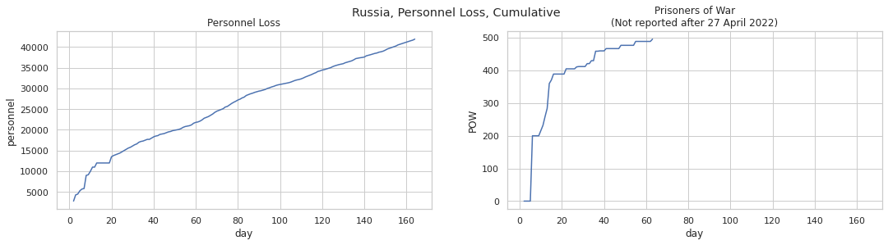
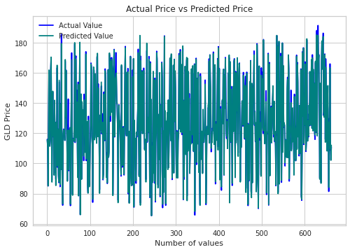

# Masud Rahman
Research Economist | Data Analytics | Machine Learning Portfolio

[![LinkedIn][LinkedInLogo]][LinkedInURL] [![Twitter][TwitterLogo]][TwitterURL] [![GitHub][GithubLogo]][GithubURL] 

## Featured Projects

### 1. [Russia Military Impact during Ukraine Crisis 2022](https://github.com/masud90/masud90.github.io/blob/main/assets/images/russiaimpact.png)

This Jupyter notebook automatically collects, cleans, and visualizes the impact Ukraine Crisis has had on Russia's military personnel and equipment. This notebook updates daily on Kaggle. View the kaggle notebook [here](https://www.kaggle.com/code/masudrahman19/visualizing-russian-defense-loss-in-ukraine-2022), or the github notebook [here](https://github.com/masud90/Russia-Military-Impact-during-Ukraine-Crisis-2022).

### 2. [Predicting Gold Prices Using 15 Year Market Data](https://github.com/masud90/Predicting-Gold-Price-using-Machine-Learning/blob/main/gold-price-prediction-using-15-year-market-data.ipynb)

In this Jupyter notebook, we use machine learning models to predict gold price in the future based on 5 ETF/ portfolio performances in the stock market over a period of 15 years. We use publicly available adjusted closing price data pulled from stock market.

**Data Summary:**

This dataset contains 6 variables as follows:

1. Date: date for which market data is collected. Date will become our index in the dataframe.
2. ^GSPC: Standard & Poor's price index of 500 U.S. companies.
3. GLD: SPDR Gold Shares ETF.
4. USO: The United States Oil Fund, ETF.
5. SLV: Silver ETF. Purely reflects the price movements of silver.
6. EURUSD=X: euro against U.S. dollar exchange rate.

**Results:**

Using this data, we create a random forest model, that gives us predictions with an R-squared error value of 0.993 which is considered very robust.

### 3. Machine Learning in Humanitarian Context: Predicting Likelihood of Depression Using Socioeconomic Survey Data in Refugee Camps and Their Hosts
[Pre-print draft forthcoming]

[LinkedInLogo]: ./assets/images/linkedin.png
[TwitterLogo]: ./assets/images/twitter.png
[GithubLogo]: ./assets/images/github.png

[LinkedInURL]: https://linkedin.com/in/Masud90
[TwitterURL]: https://twitter.com/masudtweets
[GithubURL]: https://github.com/masud90
